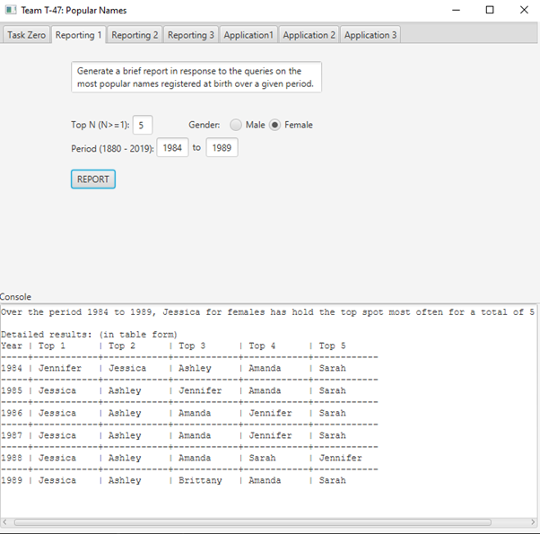
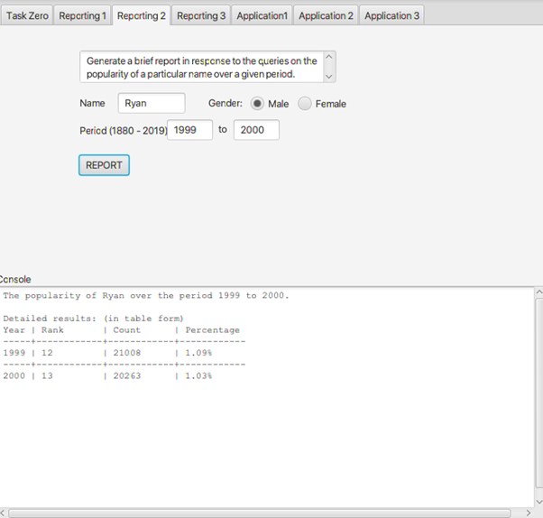
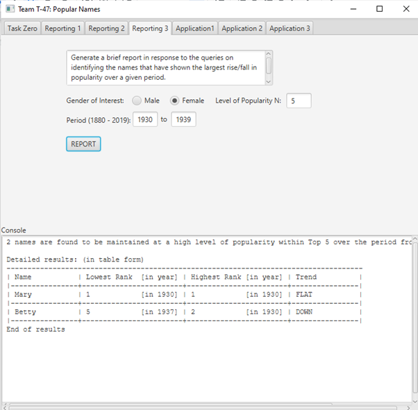
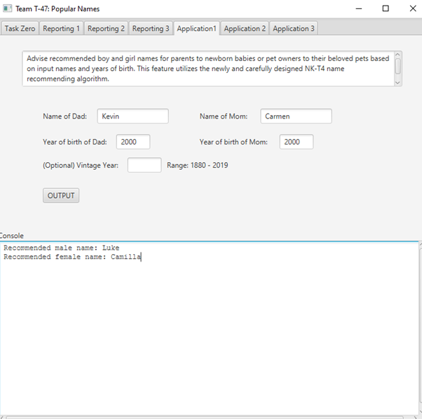
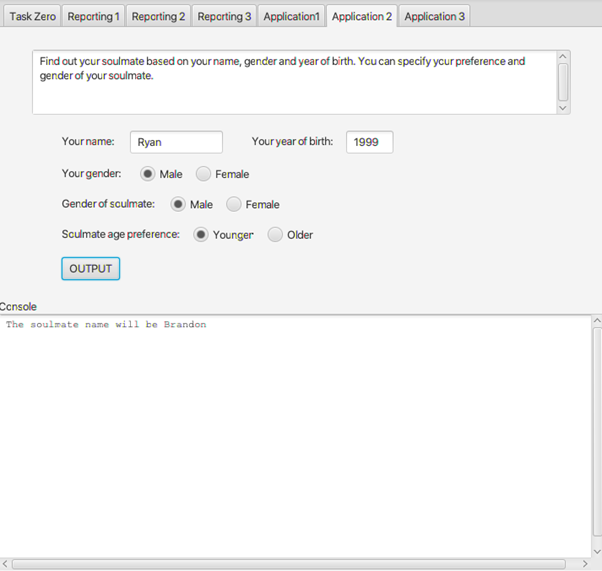
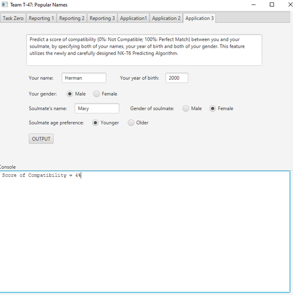

# COMP3111 Project Team T-47
> https://github.com/owen-hwlee/hkust-comp3111-project-t47.git

## 1. LEE Ho Wan Owen
> email: hwolee | github: owen-hwlee | dev branch: owen_dev

> Task 1 & Task 4

## 2. WONG Pak To
> email: ptwongaa | github: hermanwpt | dev branch: herman_dev

> Task 3 & Task 6

## 3. LAM Lok Hang
> email: lhlamae | github: ryanlamm | dev branch: ryan_dev

> Task 2 & Task 5

## Tasks Sample Input and Output

> Task 1  

> Task 2  

> Task 3  

> Task 4  

> Task 5  

> Task 6  

## Relevant Documentations
### Unit Testing Report
[Unit test report](./src/main/resources/reports/tests/test/index.html)
### Coverage Test Report
[Test coverage](./src/main/resources/jacocoHTML/index.html)
### JavaDoc Documentation
[JavaDoc documentation](./src/main/resources/docs/javadoc/comp3111/popnames/package-summary.html)